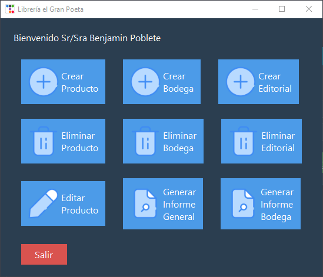
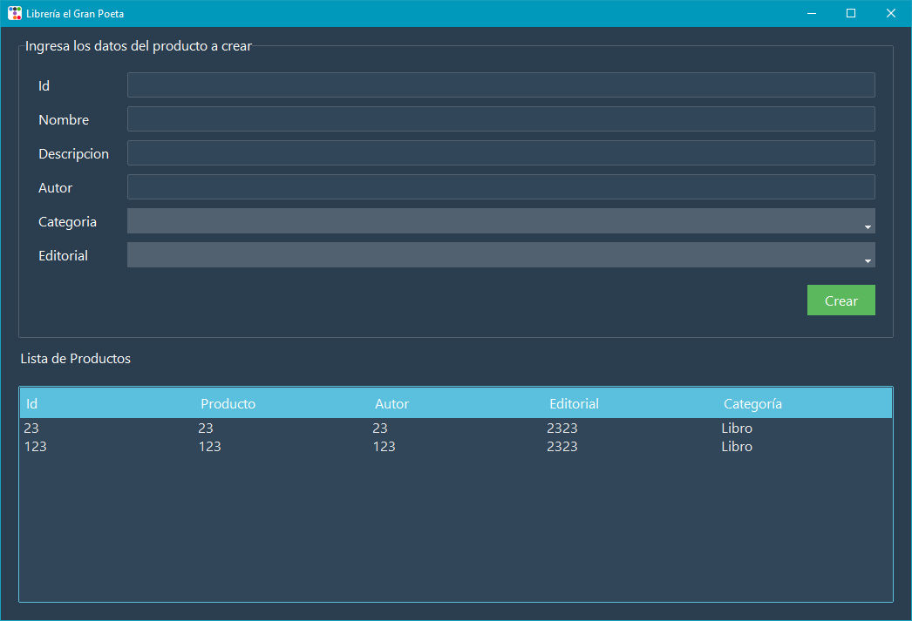

# django-appBodegas

Proyecto final para el taller de aplicaciones año 2022.

Usa el patrón de arquitectura MVC DAO-DTO.

## Instalación

Crea la base de datos con el script de sql bodegasTk.sql
    
Ejecuta el main.exe o corre desde el main.py

## Tecnologías
* Python
* Tkinter
* MySql  
  
## Screenshots : 

